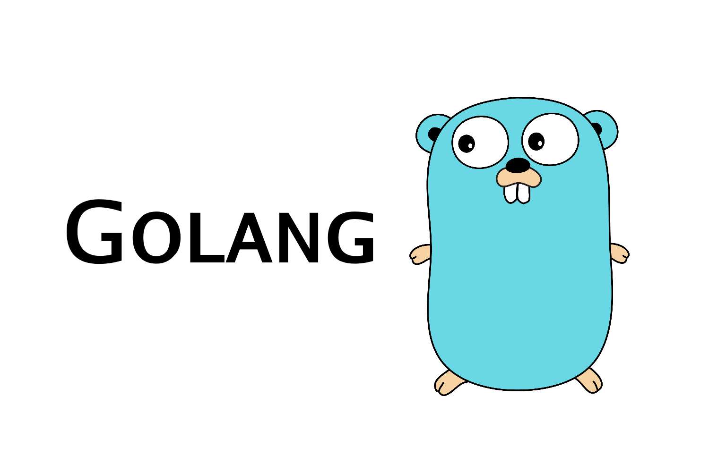

---

# Go Practitioner since 2014

Pallat Anchaleechamaikorn
Technical Coach at Infinitas by KrungThai

https://tour.golang.org
https://github.com/uber-go/guide

---

# Why Go?

https://insights.stackoverflow.com/survey/2020#technology-programming-scripting-and-markup-languages


---

# Github stat

https://madnight.github.io/githut/#/pull_requests/2020/4


---

# The top 10 coding languages recruiters are looking for right now

https://www.businessinsider.com/top-coding-languages-recruiters-are-looking-for-right-now-2020-9


---

# 12 Programming Languages That Pay Ultra-High Salaries

https://insights.dice.com/2020/10/13/12-programming-languages-that-pay-ultra-high-salaries/


---

# What is Go?

Go is a statically typed, compiled programming language designed at Google by Robert Griesemer, Rob Pike, and Ken Thompson


---

# History of Go

Go was designed at Google in 2007.
Go was publicly announced in November 2009, and version 1.0 was released in March 2012.

---

# Why Go again?

https://insights.stackoverflow.com/survey/2020/#technology-most-loved-dreaded-and-wanted-languages


---

# Go Users

https://github.com/golang/go/wiki/GoUsers

---

# Go in KrungThai

- Next
- One Baht Bond
- เราเที่ยวด้วยกัน
- etc.

---

# Go is Simple

```go
package main

import (
	"fmt"
)

func main() {
	fmt.Println("Hello, Gophers")
}
```

---

# Only 25 Keywords

```txt
break        default      func         interface    select
case         defer        go           map          struct
chan         else         goto         package      switch
const        fallthrough  if           range        type
continue     for          import       return       var
```

---

# Official Golang Page

https://golang.org/ https://golang.org/
https://go.dev/ https://go.dev/


[Next >](./basic.md#1)

---
